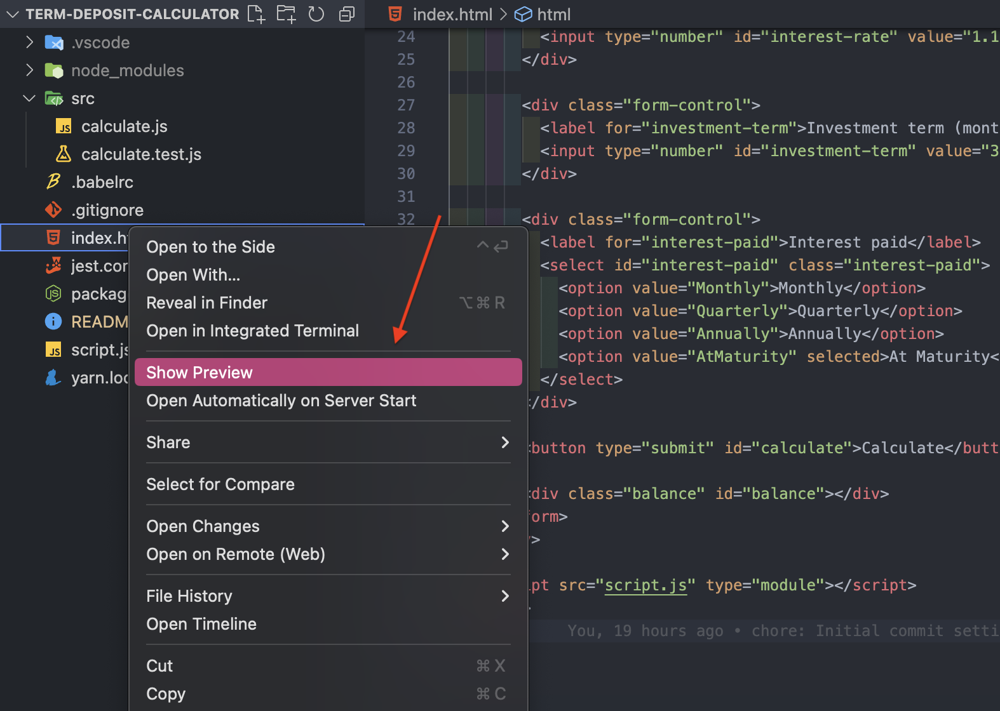

# term-deposit-calculator

A calculator that is used to forecast the return on a term deposit.

## About the project

This project serves as a simple hands-on app created using Vanilla Javascript, HTML and CSS.

## Getting started

To get started with this project, follow these simple steps:

1. Clone this repository to your local machine
1. If you're using Visual Studio Code, you can install the [Live Preview](https://marketplace.visualstudio.com/items?itemName=ms-vscode.live-server) extension which provides a local server for the static files. This is required because this project use ES6 module syntax. You will run into issues like CORS, module loading and relative paths if you open the file directly from the browser.
1. After installing the extension, right-click on the `index.html` file in the root directory, and you'll see an option to `Show Preview` (see screenshot below). Clicking this option will launch a development server and open the HTML file.

If you don't use Visual Studio Code or have issues opening the file, you can checkout a different version of the project on this branch. This branch does not use ES6 module loading. Opening the file should be as easy as opening the `index.html` using your favourite browser.

## Running the tests

This project was created using test-driven development because I truly care about quality 🤩

1. Make sure you have `yarn` install. Follow these [instructions](https://classic.yarnpkg.com/en/docs/install#mac-stable) if you don't have it.
1. `yarn install` in the root directory to install all dependencies.
1. `yarn test` to run all the unit tests available.

I hope you find this project enjoyable and educational. Happy calculating!
